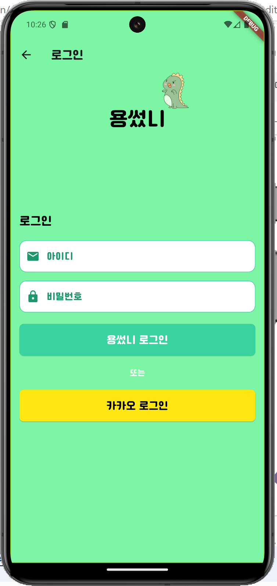
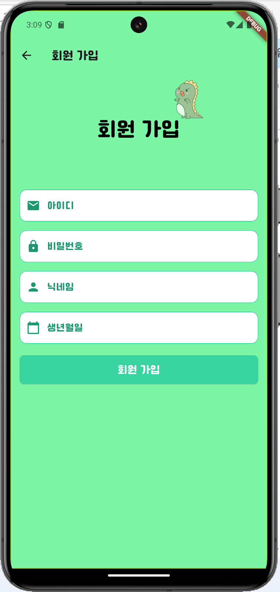
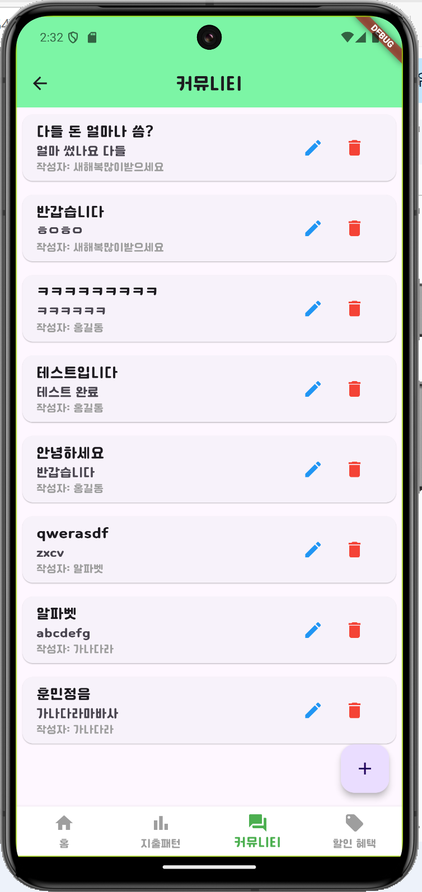
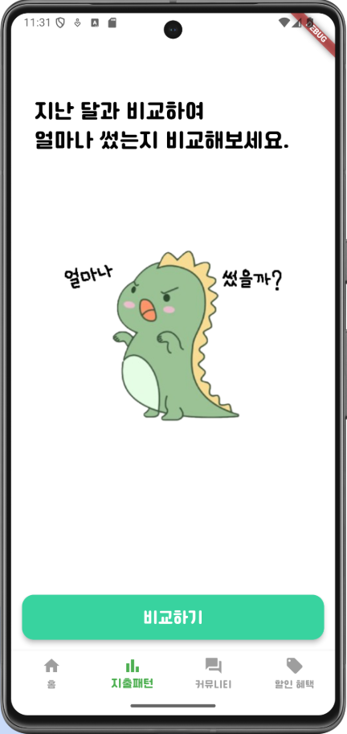
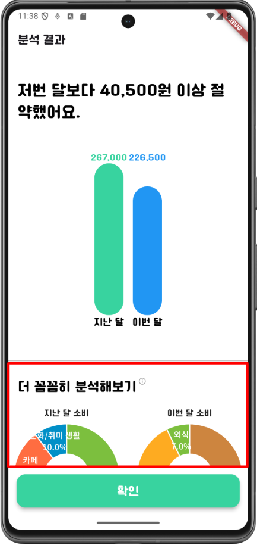
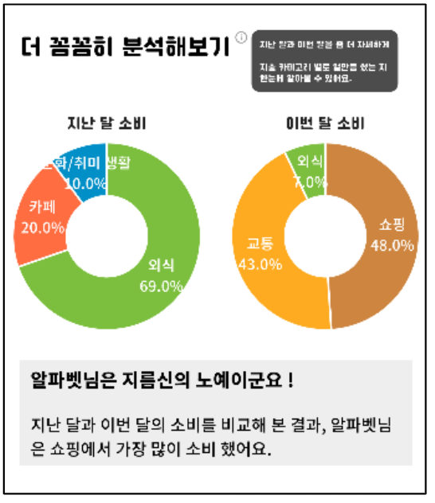
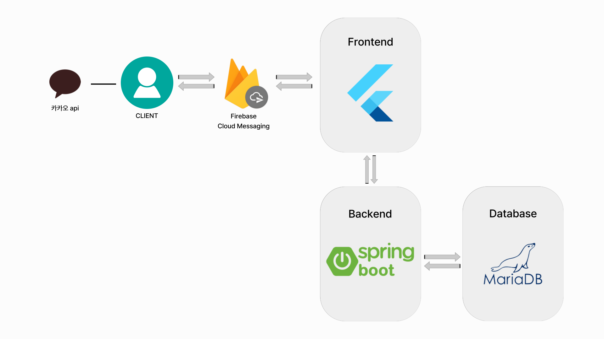

# flutter_yong_sseotni
A budgeting app for students 💰

## Contributors ♥️ 

**Frontend**: [Nyeonggyeong Song](https://github.com/nyeonggyeong)  
**Backend**: [Nahyun Kim](https://github.com/Comets-nana)

## Stacks⚔️

### Environment

### Development

### Communication & Docs

## Key Features ⭐

### 1. Login & Sign Up (로그인 & 회원가입) 
Users can sign up with their email and password, and securely log into the app to manage their personal finance.

---

### 2. Calendar(캘린더)  
A calendar view where users can track their daily expenses and incomes. It helps visualize spending habits over time.

---

### 3. Community(커뮤니티)  
A space for students to share tips, ask questions, and communicate about how to save or manage money better.

---

### 4. Spending Pattern(지출 패턴)  
This section shows analytics on spending behavior, helping users identify where they spend the most and discover ways to save.

  

---
## Architecture 🗂️ 
This diagram shows the overall system architecture, including the frontend, backend, and database interactions.

